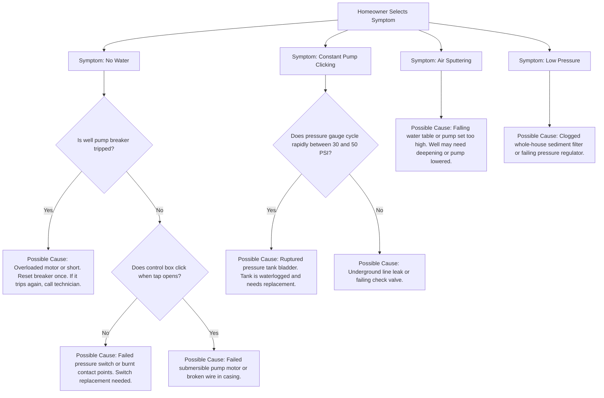

# Phase 2 — Value-First Reciprocity Calculator Specification

Following the Bigfoot Core Principle of **Reciprocity Prioritization**, the Water Well Directory must feature an un-gated, interactive utility tool above the fold. This tool delivers instant technical sizing, diagnostics, and cost projections to homeowners before routing them to localized directory listings.

This document details the architecture, formulas, logic trees, and directory integration rules for the **Unified Well System Calculator**.

---

## 1. Architectural & UI Guidelines

*   **Zero-Client-JS Default (Astro):** The page structure, styles, and initial state are shipped as pure HTML/CSS. Tabs are toggled using CSS radio button hacks or a tiny, dependency-free vanilla JavaScript snippet (<1KB).
*   **Performance Constraint:** All calculations must execute client-side in `<10ms` upon input change.
*   **UI layout:** A unified card component containing three interactive tabs:
    *   **Tab 1: Sizing & CapEx Cost Estimator** (Planning a new well or replacement)
    *   **Tab 2: Emergency Diagnostic Tool** (Troubleshooting an active failure)
    *   **Tab 3: Water Quality & Smell Matcher** (Diagnosing aesthetic or health issues)

---

## 2. Tab 1: Sizing & Cost Estimator (CapEx)

This tab helps homeowners calculate hardware requirements (Pump HP, Pressure Tank Volume, Water Softener Capacity) and estimate drilling costs.

### A. User Inputs
1.  **Casing Diameter:** Dropdown (`4"`, `6"`, `8"`)
2.  **Well Depth:** Number input (Feet, default `150`) OR check **"I Don't Know"**.
3.  **Equipment Selector (If "I Don't Know" is checked):**
    Homeowners select their visible pump setup to estimate depth:
    *   *Setup A: Pump is visible above ground, with a single pipe entering the well.* $\rightarrow$ Estimates depth as **20 feet** (Shallow well).
    *   *Setup B: Pump is visible above ground, with two pipes entering the well.* $\rightarrow$ Estimates depth as **80 feet** (Medium depth well).
    *   *Setup C: No pump is visible above ground (only a steel/plastic pipe capping out of the yard with electrical wires).* $\rightarrow$ Estimates depth as **150 feet** (Deep submersible well).
4.  **Geological Formation:** Dropdown (`Soft Sand/Clay`, `Medium Limestone/Shale`, `Hard Granite/Basalt`)
5.  **Household Size:** Number input (People, default `4`)
6.  **Bathrooms:** Number input (default `2.5`)

### B. Mathematical Sizing Formulas

#### 1. Water Demand (GPM)
Estimated Peak Demand is calculated using the fixture count method:
$$\text{Demand (GPM)} = (\text{Household Size} \times 1.5) + (\text{Bathrooms} \times 2)$$

#### 2. Pump Horsepower (HP) Recommendation
Pump sizing is determined by the total dynamic head (approximated by well depth) and peak demand:
*   Depth $\le 100$ ft:
    *   Demand $\le 7$ GPM $\rightarrow$ **0.5 HP**
    *   Demand $> 7$ GPM $\rightarrow$ **0.75 HP**
*   $100 \text{ ft} < \text{Depth} \le 250$ ft:
    *   Demand $\le 10$ GPM $\rightarrow$ **0.75 HP**
    *   Demand $> 10$ GPM $\rightarrow$ **1.0 HP**
*   $\text{Depth} > 250$ ft:
    *   Demand $\le 12$ GPM $\rightarrow$ **1.0 HP**
    *   Demand $> 12$ GPM $\rightarrow$ **1.5 HP+ Submersible**

#### 3. Well Pressure Tank Sizing (Gallons)
Drawdown volume should equal the pump's 1-minute run time capacity:
$$\text{Tank Volume (Gallons)} = \text{Demand (GPM)} \times 4$$
*( Bladder tanks typically operate at 25% drawdown efficiency, requiring a tank 4x the GPM capacity. Example: 10 GPM demand $\rightarrow$ 40-gallon bladder tank minimum).*

### C. Cost Estimation Formulas
*   **Base Drilling Rate per Foot:**
    *   *Soft Sand/Clay:* \$25 / foot
    *   *Limestone/Shale:* \$35 / foot
    *   *Hard Granite:* \$55 / foot
*   **Casing Cost:** (Depth + 20 ft) $\times$ Casing Diameter Factor (4" = \$12/ft, 6" = \$18/ft, 8" = \$28/ft)
*   **Pump & Tank Kit:** \$1,500 (0.5 - 0.75 HP) to \$2,500 (1.0 - 1.5 HP)
*   **Permitting & Hookup Fees:** \$1,000 flat
$$\text{Total Est. Cost} = (\text{Depth} \times \text{Drilling Rate}) + \text{Casing Cost} + \text{Pump/Tank Kit} + \text{Permits}$$

---

## 3. Tab 2: Emergency Diagnostic & Troubleshooting

This tab walks homeowners through sudden well systems failures using an interactive, symptom-driven decision tree.

### A. Symptom Logic Tree

### B. Output & Safety Advice
For every result, display a high-contrast safety warning:
> [!WARNING]
> **Avoid Pump Burnout:** If your pump is cycling constantly or running without producing water, immediately **turn off the well pump breaker** at your electrical panel. Running a pump dry will overheat and destroy the motor, converting a \$200 switch repair into a \$3,000 pump replacement.

---

## 4. Tab 3: Water Quality & Smell Matcher

This tab translates aesthetic and health concerns into hardware recommendations.

### A. Symptom Matcher Matrix

| User Symptom | Likely Cause | Recommended Hardware | Est. Equipment Cost |
| --- | --- | --- | --- |
| **Rotten Egg / Sulfur Smell** | Hydrogen Sulfide gas | Air Injection Oxidizing Filter OR Active Carbon Backwash Filter | \$1,200 - \$2,200 |
| **Orange/Red Stains on Fixtures** | Iron content | Iron Cleer Filter / Manganese Greensand Filter | \$1,500 - \$2,500 |
| **White Scale Stains & Soap Scum** | Calcium / Hard Water | Water Softener (Sized below) | \$1,000 - \$1,800 |
| **Sewage / Bad Odor** | Bacterial contamination | UV Disinfection System + Chlorine Injection | \$900 - \$1,500 |
| **Blue/Green Copper Stains** | Acidic water (pH < 6.5) | Acid Neutralizing Tank (Calcite/Magnesite) | \$1,100 - \$1,800 |

### B. Water Softener Capacity Sizing
If the user inputs their Hardness grains per gallon (GPG) and Household size, calculate the daily grain capacity needed:
$$\text{Daily Grains} = \text{Household Size} \times 75 \text{ gallons/day} \times \text{Hardness (GPG)}$$
$$\text{Recommended Softener Capacity} = \text{Daily Grains} \times 7 \text{ days (Regeneration interval)}$$
*(Example: 4 people $\times$ 75 gallons $\times$ 15 GPG Hardness = 4,500 grains/day. Over 7 days = 31,500 grains. Recommends a **32,000 Grain Capacity Softener**).*

---

## 5. Reciprocity Routing Loop (Directory Integration)

The ultimate goal of the calculator is to route the user to the correct category of verified contractors in their county. Based on the calculator output, dynamic CTA buttons will pre-filter directory listings:

1.  **Tab 1 Cost/Sizing Outputs:**
    *   Link to: `site.com/listings?county={county}&service=well-drilling`
    *   Pre-filters companies matching: `handles_new_permits = 1`
2.  **Tab 2 Emergency Diagnostic Outputs:**
    *   Link to: `site.com/listings?county={county}&service=pump-repair`
    *   Pre-filters companies matching: `has_24_7_emergency_service = 1`
3.  **Tab 3 Water Quality Outputs:**
    *   Link to: `site.com/listings?county={county}&service=water-treatment`
    *   Pre-filters companies matching: `has_water_testing_lab = 1`
