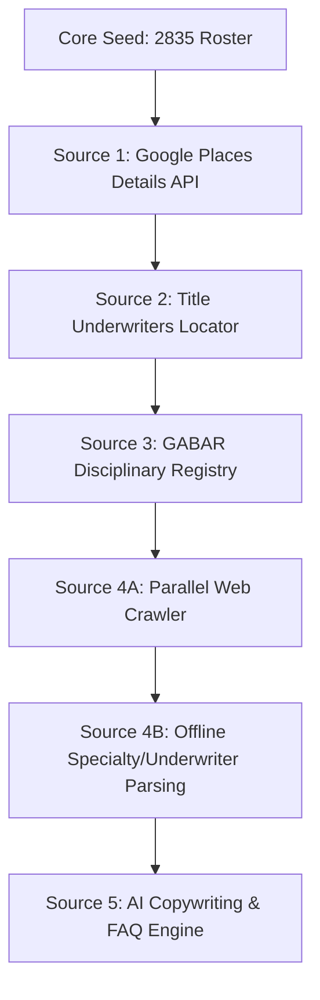

# Enrichment Plan: Georgia Real Estate & Closing Attorneys

This document outlines the systematic, source-by-source enrichment plan for the **Georgia Closing Attorneys Directory (`01-GABAR`)** database.

---

## 📋 Core Ingestion Principles

In accordance with user feedback and rule **R-106**:
1. **Source-by-Source Processing:** We will enrich the entire database of 2,835 records with one specific data source before moving on to the next. We will *not* attempt to fetch multiple distinct APIs or scrape websites simultaneously for a single record.
2. **Iterative Verification (The 5-50 Scale Rule):** For every enrichment source, we will:
   - Run a test of **5 records** to verify the request payload, API connectivity, and JSON parsing logic.
   - Run a batch of **50 records** with a polite rate-limiting delay to audit data freshness, matching accuracy, and error logs.
   - Scale to the full **2,835 records** only after the first 55 runs have successfully committed without errors.
3. **Idempotency & Local Caching:** All scripts must save progress directly back to the database (`directory.sqlite`) after each record is fetched. If a run is interrupted, it must be able to resume exactly where it left off without duplicate API calls or coordinate bills (enforcing **R-101**).

---

## 🗺️ Enrichment Ingestion Sequence

The enrichment pipeline will be executed in five sequential phases, where each phase represents a single data source:

| Sequence | Enrichment Source | Target Data Fields | Primary Key Matcher | Downstream Dependency |
| :--- | :--- | :--- | :--- | :--- |
| **Source 1** | Google Places & Details API | Website URL, coordinates (lat/lng), phone, business hours, rating, reviews | `[Company Name]` or `[First Last] Attorney` + `[City], GA` | Required to obtain the `website_url` for Source 4 crawling. |
| **Source 2** | Title Underwriters Locator | Appointed title companies (Chicago Title, First American, Old Republic, etc.) | `[Company Name]` or `[Last Name]` + `[County]/[City]` | Directly validates "Active Title Agent" trust tier. |
| **Source 3** | GABAR Disciplinary Page | Historic regulatory disciplinary cases or "None" | `[bar_number]` (Exact match) | Verified bar standing status check. |
| **Source 4A** | Parallel Web Crawler | Raw, deduplicated text cache of the site | `[website_url]` (Scraped in Source 1) | Caches deduplicated text to prevent duplicate crawls. |
| **Source 4B** | Offline Cache Extraction | Specialties keywords and Underwriter networks | `[id]` (matches local cache file) | Determines classification category taxonomies offline. |
| **Source 5** | AI Generation (Antigravity) | Listing content (200-400 words), Speakable blocks, Quick facts, 20 FAQs | `[id]` (Internal DB record) | Final compilation step before rendering Astro markdown templates. |

---

## 🛠️ Phase-by-Phase Implementation Specifications

### Source 1 — Google Places Details API
- **Objective:** Fetch physical business details, location coordinates, and public reputation scores.
- **Data Fields Written:** `website_url`, `latitude`, `longitude`, `phone`, `google_rating`, `google_review_count`, `review_1_text`, `review_2_text`, `review_3_text`.
- **Match Strategy:** 
  1. Primary Query: `"[company] real estate attorney [city] GA"`
  2. Fallback Query (if company is empty or no match): `"[first_name] [last_name] closing attorney [city] GA"`
- **Politeness & Limits:** Enforce a 0.5-second delay between search queries. Cache matches locally by checking if coordinates already exist in the database (enforcing **R-101**).

### Source 2 — Title Underwriters Locator
- **Objective:** Map which national title insurance underwriting networks the attorney represents.
- **Data Fields Written:** `appointments` (JSON/CSV list of appointments).
- **Underwriters Targeted:** First American, Chicago Title, Fidelity National, Old Republic, Stewart, Investors Title.
- **Match Strategy:** Query the local cache or scrape public underwriter agent finders matching firm names.

### Source 3 — State Bar of Georgia (GABAR) Disciplinary Registry
- **Objective:** Scrape details of public disciplinary history.
- **Data Fields Written:** `disciplinary_history`.
- **Match Strategy:** Extract the GABAR member page using the GABAR UUID (`gabar_id`) from our seed data and scrape the "Discipline History" section. If no discipline is listed, default to `"None"`.

### Source 4A — Parallel Website Crawler
- **Objective:** Crawl the attorney's official website home and up to 4 interior pages concurrently, extracting content.
- **Data Fields Written:** Generates an `[id].txt` text cache file locally (`cache/crawled_text/georgia-closing-attorneys/`).
- **Match Strategy:** Uses `requests` and `BeautifulSoup` concurrently with up to 5 workers. Applies cross-page line frequency filtering ("ddp") to strip repeated boilerplate elements (navigation, footers).

### Source 4B — Offline Extraction (Specialties & Underwriters)
- **Objective:** Read the fast, local deduplicated `.txt` cache and parse for taxonomy rules and networks.
- **Data Fields Written:** `specialties` (JSON flags) and `appointments` (Underwriter networks).
- **Match Strategy:** Use fast offline Regex matches against the text. Since this is fully decoupled from live HTTP fetching, we can adjust keyword arrays and rerun across the 2,800 records instantly.

### Source 5 — AI Content Ingestion & Quality Gate
- **Objective:** Generate rich, anti-thin localized content pages for Astro.
- **Data Fields Written:** `listing_content`, `speakable_what_you_find`, `speakable_listing_details`, `speakable_quick_facts`, `quickfact_best_for`, `quickfact_primary_items`, `quickfact_fee_structure`, `quickfact_access`, `faq_enriched`.
- **Quality Gate Verification:** Evaluates listing content word count, presence of a valid bar license, and Q&A completions before allowing the page to compile to Astro (as detailed in [architect-schema.md](file:///c:/Users/tamo4/git/nhq-bigfoot-blueprint/02-workbench/georgia-closing-attorneys/architect-schema.md#L304-L311)).
