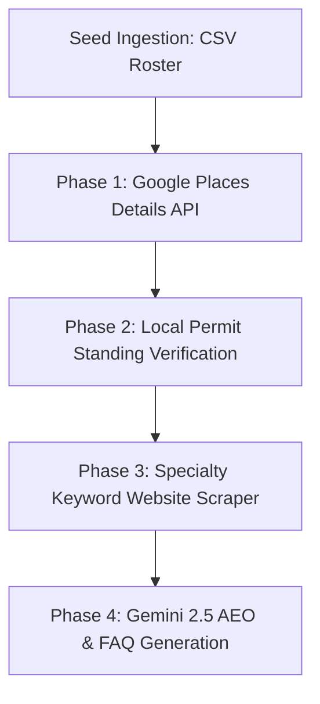

# Enrichment Plan: Macon Septic & Grease (`02-SEPTIC`)

This plan outlines the sequential phases of data enrichment for the `02-SEPTIC` database.

---

## 🗺️ Enrichment Sequence Diagram

| Sequence | Enrichment Source | Target Data Fields | Matching Strategy |
| :--- | :--- | :--- | :--- |
| **Phase 1** | Google Places Details API | Phone, website, geometry coordinates, Google rating, review count, review snippets | `[company_name] + [city]` matching text search ID |
| **Phase 2** | DPH / MWA Permit Logs | `license_status` (Active/Inactive), permit validity | Permit/License number cross-reference |
| **Phase 3** | Firm Website Scraper | Specialty flags (`specialty_grease_trap`, `specialty_line_jetting`, etc.) | Playwright crawl of homepage text |
| **Phase 4** | Gemini 2.5 API | `profile_bio`, `faq_json` (20 FAQs), `speakable_bio` | Offline batch run via AI Ultra model |

---

## 🛠️ Phase-by-Phase Execution Specs

### Phase 1 — Google Places Details API
* **Target Script:** `scripts/enrich-places.py`
* **Objective:** Pull coordinates, website URLs, phone numbers, and review scores for each seed record.
* **Jitter Constraint:** 0.5-second minimum delay between requests to remain polite.

### Phase 2 — Local Permit Standing Verification
* **Objective:** Establish the trust badges for each hauler.
* **Fields Written:** `license_status`, `permit_expiration`.
* **Match Strategy:** Verify if the business appears on the Macon Water Authority's active grease hauler list. If yes, mark `license_status = 'Active'`. Otherwise, default to `'Unverified'`.

### Phase 3 — Specialty Web Scraper
* **Target Script:** `scripts/enrich-specialties.py`
* **Objective:** Scan the provider's website homepages for target keywords:
  - *Grease Trap Pumping:* "grease trap", "grease interceptor", "fog removal", "restaurant trap".
  - *Septic Tank Pumping:* "septic tank", "septic pump", "sludge removal", "residential septic".
  - *Line Jetting:* "hydro jetting", "high pressure jetting", "clog jetting".
  - *Emergency Dispatch:* "24/7", "emergency service", "backup emergency", "same day".

### Phase 4 — Gemini 2.5 Profile Copywriter (AEO FAQ)
* **Target Script:** `scripts/enrich-profile-qa.py`
* **Objective:** Generate unique localized content for static page builds.
* **Gemini Prompt Instructions:**
  - Write a 200-to-300-word business summary focusing on the services they offer in Macon, GA. Do not use hedging or tentative language.
  - Compile an array of 20 Q&As mapping local regulations (such as Macon Water Authority Code Section 12 or DPH permit rules) to their services.
  - Save the structured output as a JSON-encoded array into the `faq_json` database field.
