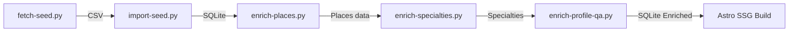

# Ingestion Pipeline Specifications: Macon Septic & Grease (`02-SEPTIC`)

This document outlines the operational specs, rate limits, caching rules, and scaling parameters for the `02-SEPTIC` data ingestion and enrichment scripts.

---

## 🛠️ Ingestion Stages & Executables

### 1. Ingestion Seed Scraper (`scripts/fetch-seed.py`)
* **Endpoint:** Google Places Text Search API.
* **Queries Executed:**
  - `"septic pumping Macon GA"`
  - `"grease trap cleaning Macon GA"`
  - `"septic tank installers Bibb County GA"`
* **Output:** Generates `septic-grease-seed.csv` in the `data/` directory, containing de-duplicated records.

### 2. Database Bootstrap (`scripts/import-seed.py`)
* **Function:** Initializes SQLite database schema at `data/directory.sqlite` and imports seed rows. Sets default status `claimed = 0`.

### 3. Google Places Detailer (`scripts/enrich-places.py`)
* **Endpoint:** Google Places Details API.
* **Fields Fetched:** `formatted_phone_number`, `website`, `opening_hours`, `geometry/location` (Latitude/Longitude), `rating`, `user_ratings_total`, and review snippets.
* **Rate Limits:** 0.5-second jitter delay between requests.

### 4. Specialty Web Crawler (`scripts/enrich-specialties.py`)
* **Target:** Company website URLs extracted in Stage 3.
* **Specialties Mapped:** Commercial grease trap pumping, residential septic pumping, riser/lid installation, line jetting, camera inspections, emergency dispatch.
* **Framework:** Sync Playwright / BeautifulSoup4 scanning website text for keyword matrices.

### 5. AI Profile & FAQ Generator (`scripts/enrich-profile-qa.py`)
* **Target:** Offline generation using Gemini 2.5 Flash/Pro.
* **Outputs:** 300-word localized company bio and an array of 20 local compliance Q&As.

---

## 🔒 Operational Safeguards (Rule R-106)

To prevent rate limits, IP blocks, and redundant API billing, all scripts must enforce:
1. **Idempotency & Checkpoint Checks:**
   - Before requesting any external API (Places API, Website scraper, Gemini API), scripts must check if the target columns in the database are already populated. If yes, the record is skipped.
2. **Jitter Delay & Politeness:**
   - Places details API: 0.5 to 1.5 seconds delay.
   - Website scraper (Playwright): 3.0 to 7.0 seconds delay with random User-Agent strings.
3. **The 5-50 Scaling Rule:**
   - Every script must accept a `--limit` flag.
   - Run a test of **5 records** to verify parsing.
   - Run a batch of **50 records** to check error logs.
   - Run the **full scale** only after the first 55 records are successfully parsed and written.
