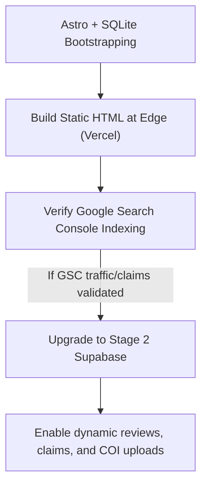

# Bigfoot Blueprint Workshop Analysis: Parts 1–7

This report synthesizes the key principles, technical structures, operational workflows, and strategic insights extracted from the first six transcripts of the Ignite Mastermind workshop on Bigfoot Blueprint directory sites.

---

## 1. Core Strategic Presentation (Perry Belcher)

### The Directory Philosophy
* **Craigslist / Drudge Report Model**: Prettiness does not pay. The ugliest sites (like Craigslist or Drudge Report) make the most money per employee because they provide highly structured, queryable data that solves decision fatigue. Users want data, not marketing fluff.
* **programmatic SEO (pSEO)**: A single blog post targets a single keyword. A directory with 10,000 pages acts as "10,000 tiny voices," capturing long-tail search traffic and providing a massive semantic surface area for search engines.
* **AI Search Integration**: AI search engines (ChatGPT Voice, Claude, Perplexity) crawl the web seeking structured JSON-LD data. Directories serve as structured data "citation pools" that these engines cite directly.

### The Five Moats
1. **The Flywheel**: More listings $\rightarrow$ More traffic $\rightarrow$ More claimed listings $\rightarrow$ More UGC $\rightarrow$ More traffic.
2. **User-Generated Content (UGC)**: Listed companies claim their profiles, upload photos, and update details, while clients write reviews. The community generates the content.
3. **Comprehensiveness**: If you do not list *every* business in a niche, the directory loses authority. You must start with the full database.
4. **Local & Niche Specificity**: Avoid general lists. Target highly specific search intent (e.g., "vegan catering in Tulsa" or "investor-friendly closing attorneys in Macon").
5. **Automated Maintenance**: Using APIs and data feeds to auto-update the directory while the owner is offline.

---

## 2. Technical Implementation & Data Workflows (Russell & Julius)

### The 4-Phase Build Workflow
1. **Phase 1: Identify & Schema**: Define the niche and standard schema fields (e.g., license status, E&O limits, geo-coordinates).
2. **Phase 2: Ingestion & Enrichment**: Pull data from public registries and use an LLM API to clean and enrich profiles (e.g., answering the "Top 20 Questions").
3. **Phase 3: Database & Code Build**: Standardize database storage (SQLite/Supabase) and deploy static Edge pages.
4. **Phase 4: Optimization & Deployment**: Inject JSON-LD schema, configure forms/webhooks for claiming, and deploy to Vercel/Netlify.

### The LLM Ingestion Math
* **Case Study (Dog Breeds)**: Perry’s team extracted 1,400 dog breeds. They ran a batch script to answer the top 20 questions for every breed using an LLM. The total API token bill was **$30**.
* **Data Sources**: Public registries, licensing boards (e.g., Georgia EPA Section 608 warm-air heating files), and municipal permit logs.

---

## 3. Community Management & Claims (Angie & Trisha)

* **The Onboarding Hook**: Emailing unverified businesses: *"Your company has been listed on GeorgiaClosingLawyers.com. Claim your profile here to verify your details, upload your Certificate of Insurance (COI), and receive your 'Verified Insured' badge."*
* **Verification Operations**:
  * Unclaimed profiles display a prominent, neutral "Unverified" notification and show ads for competitors (Loss Aversion).
  * Claiming a profile unlocks premium placement and removes competitor ads. COI verification is restricted to paid subscription tiers.
* **GSC Parallel Path**: If local vendors do not engage immediately, let the static pages age and index in Google Search Console. Once traffic trends upward, use those validation metrics to fund direct outreach or hire virtual assistants.

---

## 4. Abstracted Roadmap for Custom Astro Stack

To execute this portfolio strategy without Replit or WordPress, we implement a decoupled Astro + SQLite architecture:

1. **Astro Static Generation**: Builds lightweight, zero-JS HTML pages that load in under 50ms, earning 100/100 Lighthouse scores.
2. **SQLite File Database**: Allows Rodrigo to package the entire dataset inside the Git repo, keeping Stage 1 hosting completely free ($0/mo) on Vercel.
3. **Value-First Calculators**: Integrate interactive, un-gated tools (e.g., S-Corp Tax Savings Calculator, Closing Cost Net Sheet) in the primary viewport to trigger reciprocity before asking for leads or claimed accounts.

---

## 5. Workshop Part 5: Ingestion, Enrichment, and API Monetization

The fifth segment detailed the core data pipeline strategies, focusing on abstraction, programmatic scraping, and monetization beyond basic directory claims.

### A. Apify Two-Bot Pipeline Concept
* **Directory Intelligence Architect Bot (Bot #1)**: Analyzes the target niche, defines the required schema fields, and architects the data extraction strategy.
* **Apify Actor Builder Bot (Bot #2)**: Takes the architect's specifications and generates the actual Apify actor code (Cheerio/Playwright) to scrape the registries.
* **Data Structuring Flow**: The pipeline starts with raw seed data $\rightarrow$ runs through geocoding (Google Places API) $\rightarrow$ executes LLM Q&A enrichment $\rightarrow$ outputs clean CSV/JSON for the database.

### B. Architect Bot Insights: Niche Selection & "Programmatic Armor"
* **Urgency Multiplier**: Niche selection should prioritize industries where buyers have a high urgency and immediate need (e.g., grease trap backups, emergency plumbing). They need instant structured utility, not long-form research.
* **Programmatic Armor**: To immunize against Google's "thin content" penalties, directories must deploy deep schemas (e.g., 93+ distinct data fields) per listing, mimicking the depth of an investigative journalist.
* **AI Engine Mechanics**: AI crawlers (like Perplexity and ChatGPT) do not scrape tabular data well. Data must be enriched into conversational, authoritative Q&A blocks to satisfy these answer engines.

### C. API Licensing & Brokerage
* **B2B Data Licensing**: Once a niche directory data set is thoroughly cleaned and enriched, the directory owner can monetize it by licensing the API endpoints to other software vendors, CRM providers, or B2B platforms.
* **API Trust Scoring**: Buyers evaluate APIs based on algorithmic trust scores, factoring in server uptime, data accuracy, documentation quality, and latency.

---

## 6. Workshop Part 7 Strategic Insights

The final segment of the workshop focused on operational setup, troubleshooting, and leveraging Cialdini's persuasion psychology to drive virality and claim conversions:

### A. Replit & Monorepo Infrastructure Debugging
* **Express 5 Routing Sync**: With Express 5 upgrading its routing library (`path-to-regexp` v8), bare `*` wildcards cause routing failure. Wrapping the wildcards in parameter brackets (`{*filePath}` or `{*wildcard}`) resolves routing conflicts for static SPA hosting and file storage.
* **Container Health Check Routing**: Cloud Run and autoscale targets require the server to listen on port 8080. The backend configuration must map production traffic to port 8080, serving the REST API and compiled SPA static assets simultaneously to ensure container health check compliance.
* **Automating Onboarding Wizards**: By creating a secure API endpoint (`GET /api/setup/token`) exposed only when `installed=false`, the onboarding React client can auto-fetch and silently apply setup tokens, removing manual onboarding friction in new container instances.

### B. Value-First Virality & Reciprocity Funnel
* **The "date before sex" marketing playbook**: Avoid putting lead gates or billing upfront. Offer high-utility, un-gated tools (calculators, pricing planners, generators) for free. This allows sharing the site in neighborhood Facebook groups and Reddit forums without moderator backlash.
* **The Guest Mode Transition**: Let users perform calculations freely in guest mode. When they need to save their state, customize results, or export PDF reports, prompt them to register a free account. This lowers initial friction while capturing emails at the point of maximum value delivery.
* **Conquest Ads & Scarcity**: Incentivize profile claims through loss aversion. Unclaimed profiles show active ads for competitor businesses.
