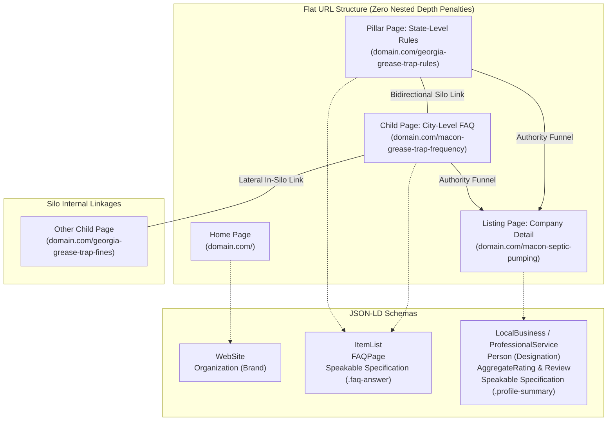
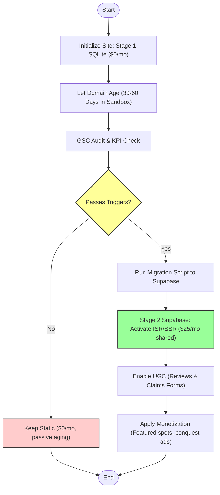

# Bigfoot Blueprint Lifecycle & Architecture Workflow

This document maps the comprehensive, end-to-end operational workflow of the **Bigfoot Blueprint Niche Directory Framework**. It traces the journey of a directory "ship" from initial niche viability assessment to programmatic data ingestion, LLM enrichment, static deployment (Stage 1), and dynamic Supabase promotion (Stage 2).

---

## 🗺️ Master Workflow Diagram

Below is the global flow of the Bigfoot Blueprint assembly line, coordinating the 4-Phase Factory with the hosting/database lifecycle.

```mermaid
graph TD
    %% Phase 1
    subgraph P1 ["Phase 1: Selection & Viability"]
        A["Identify fragmented B2B niche"] --> B["Evaluate scorecards:<br>- Avatar Adjacency<br>- Scale vs. Frequency<br>- Expansion Modifiers"]
        B --> C{"Viable?<br>(2,000+ records available?)"}
        C -- No --> D["Discard / Shelve Niche"]
        C -- Yes --> E["Define target geocoding & geo-multiplexing plan"]
        E --> E2["Run AnswerThePublic Keyword Research"]
        E2 --> E3["Write Search Intent Map<br>(defines DB columns & scraper targets)"]
    end

    %% Phase 2
    subgraph P2 ["Phase 2: Agentic Discovery"]
        E3 --> F["Bot #1 (Architect):<br>Map 7-Layer Hierarchy & SEO Silos"]
        F --> H["Design un-gated Hormozi reciprocity tool<br>(calculators above the fold)"]
        E3 --> G["Configure Apify/Playwright scraper schema<br>(custom fields from Intent Map)"]
    end

    %% Phase 3
    subgraph P3 ["Phase 3: Engineering Pipeline"]
        H --> I["Deploy scraper to harvest public registries<br>(PDFs parsed locally via python - Rule R-108)"]
        G --> I
        I --> J["Clean & geocode listings with local cache - Rule R-101"]
        J --> K["Programmatic enrichment loop via Gemini<br>natively inside Antigravity IDE ($0 token billing)"]
        K --> L["Compile outputs into a local directory.sqlite database"]
    end

    %% Phase 4
    subgraph P4 ["Phase 4: Antigravity Deployment"]
        L --> M["Swaps directory.sqlite into Astro static template"]
        M --> N["Astro pre-renders 100% static HTML pages<br>(Zero JS, 100/100 Lighthouse target)"]
        N --> O["Inject JSON-LD schemas & speakable markup<br>(WebSite, ItemList, FAQPage, LocalBusiness)"]
        O --> P["Commit code & DB to Git -> Edge deploy to Vercel/Netlify<br>($0/mo hosting, $0/mo DB)"]
        P --> Q["Log new site in directory-registry.md"]
    end

    %% Stage 1 Tracking & Promotion Gate
    subgraph Gate ["Stage 1 Tracking & Promotion Gate"]
        Q --> R["Monitor GSC impressions, indexing, & claims for 30-60 days"]
        R --> S{"Promotion Trigger Met?<br>- >= 2 claims, OR<br>- Traffic/Impression Threshold"}
        S -- No --> T["Retain as Stage 1 Static Site<br>($0/mo passive domain aging)"]
        S -- Yes --> U["Promote to Stage 2"]
    end

    %% Stage 2 Upgrade
    subgraph P5 ["Stage 2: Dynamic Supabase Integration"]
        U --> V["Rodrigo runs migration script:<br>SQLite Schema/Data to Supabase (directory_id tenant key)"]
        V --> W["Re-configure Astro site to ISR/SSR hybrid connected to Supabase"]
        W --> X["Enable dynamic client features:<br>- Claims Portal<br>- COI/OCR certificate validation via Gemini<br>- Dynamic user-generated reviews"]
        X --> Y["Activate Phase 2 Monetization Stack<br>(Premium badges, Conquest ads, Lead Gen RFQs)"]
    end

    style C fill:#f9f,stroke:#333,stroke-width:2px
    style S fill:#ff9,stroke:#333,stroke-width:2px
    style T fill:#fcc,stroke:#333,stroke-width:1px
    style Y fill:#9f9,stroke:#333,stroke-width:2px
```

---

## 🔎 The 48-Hour Ingestion & Rapid Bootstrapping Sequence

This flowchart outlines the precise sequence of tasks completed within the first 48 hours of targeting a new niche, maximizing speed and minimizing developer overhead.

```mermaid
graph LR
    subgraph Step1 ["Step 1: Discover & Audit (1 Hour)"]
        A["Niche Viability & Registry Audit"]
    end
    subgraph Step2 ["Step 2: Keyword Research & Mapping (2 Hours)"]
        A --> B["AnswerThePublic Crawls & Intent Map Creation"]
    end
    subgraph Step3 ["Step 3: Data Extraction (3 Hours)"]
        B --> C["Registry Scraping (Apify/Playwright)"] --> D["Data Cleansing & Geocode Caching"]
    end
    subgraph Step4 ["Step 4: LLM Enrichment (4 Hours)"]
        D --> E["Gemini Loop for Profile Enrichments"] --> F["Structured JSON-LD Output Compilation"]
    end
    subgraph Step5 ["Step 5: Astro Build (2 Hours)"]
        F --> G["Astro SQLite Compilation & Schema Check"] --> H["Commit Code & Database to Git"]
    end
    subgraph Step6 ["Step 6: Edge Deploy (1 Hour)"]
        H --> I["Vercel/Netlify Deployment"] --> J["Register Domain & Update Control Plane"]
    end

    style Step1 fill:#f9f,stroke:#333,stroke-width:1px
    style Step2 fill:#bbf,stroke:#333,stroke-width:1px
    style Step3 fill:#bfb,stroke:#333,stroke-width:1px
    style Step4 fill:#fbb,stroke:#333,stroke-width:1px
    style Step5 fill:#ffb,stroke:#333,stroke-width:1px
    style Step6 fill:#dff,stroke:#333,stroke-width:1px
```

### 1. Step 1: Niche Discovery & Audit (1 Hour)
* **Viability Scorecard**: Evaluates niches using the core formula:
  $$\text{Sustainable Lead Volume} = \text{Purchase Frequency} \times \text{Geographic Scale}$$
* **Avatar Adjacency Cluster**: Checks if this niche serves an existing target avatar (e.g., grease trap pumping is adjacent to fire suppression, hood cleaning, and commercial pest control).
* **Registry & Competitor Audit**: Verifies that state/county regulatory registries exist and evaluates competitor website footprints.

### 2. Step 2: Programmatic Keyword Research & Search Intent Mapping (2 Hours)
* **AnswerThePublic API Runs**: Programmatically runs keyword queries via the AnswerThePublic script (`02-workbench/answerthepublic/scripts/fetch-atp.py`) and caches results in `cache/` to avoid redundant credit usage.
* **Search Intent Mapping**: Writes a `p1_` prefixed mapping document (e.g. `p1_keyword_intent_map.md`) linking user queries to the database schema, scraper keywords guidelines, and above-the-fold calculator design.

### 3. Step 3: Target Data Extraction & CSV Clean (3 Hours)
* Scrapes state licensing board registries or municipal PDF archives, customized to extract the capability flags identified in Step 2.
* **Scraper rules**:
  * **Rule R-106**: Keep scrapes small, self-contained, and non-duplicate.
  * **Rule R-108**: Download and parse PDFs locally using Python (`fitz`/`pypdf`) rather than attempting visual browser scrapes.
  * **Rule R-109**: strictly prohibit fictional or synthetic placeholders for license registries and compliance data.
  * **Rule R-101**: Always cache geocoding requests locally in the SQLite cache.

### 4. Step 4: Programmatic LLM Enrichment (4 Hours)
* Feeds raw data records to Gemini (Flash/Pro) inside the Antigravity IDE using the AI Ultra subscription ($0 token cost).
* Generates conversational Q&A blocks answers to the **Top 20 Questions** for each directory profile.
* Writes final outputs to a local `directory.sqlite` file.

### 5. Step 5: Astro SQLite Git Build (2 Hours)
* Places the compiled `directory.sqlite` inside the Astro template's data layer.
* Runs local build to verify sitemaps, flat URL mappings (`/ga/macon-septic-pumping`), and `<head>` schema bindings.

### 6. Step 6: Edge Deploy to Vercel/Netlify (1 Hour)
* Hooks the repository to Vercel/Netlify for automatic edge deployments on push.
* Adds the project domain, niche description, and initial metrics to [directory-registry.md](file:///c:/Users/tamo4/git/nhq-bigfoot-blueprint/directory-registry.md).

---

## 📈 Search Silo & Schema Architecture

The programmatic layout of directory pages establishes authority with search engine bots and AI retrieval agents (AEO).

---

## 💰 The Promotion Gate & Database Lifecycle

To protect the portfolio budget from inflating database licensing fees, directories start on a $0/mo static layer, migrating to Supabase only when validation metrics are verified.

| Stage | Database Engine | Hosting Platform | Dynamic Capabilities | Cost | Promotion Trigger |
| :--- | :--- | :--- | :--- | :--- | :--- |
| **Stage 1: Launch** | **SQLite File** (Committed directly to Git) | **Vercel / Netlify** (Static Site Generation) | Disabled (Read-only, static templates) | **$0/mo** | Default state upon initialization |
| **Stage 2: Upgrade** | **Multi-Tenant Supabase** (PostgreSQL partitioned by `directory_id`) | **Vercel / Netlify** (ISR/SSR Hybrid) | Enabled (Reviews, Claims, COI/OCR uploads) | **$25/mo** (Consolidated for up to 10+ directories) | **Engagement Gate:** >= 2 claims filed, OR **Traffic Gate:** impressions & clicks hit thresholds for 3 consecutive weeks |
| **Stage 3: Enterprise** | **Dedicated Railway Postgres** / Supabase | **Railway / Vercel** | Enabled (B2B API integrations, dispatch tools) | **Variable** | Directory generates consistent cash-flow |

---

## 🛡️ Operational Guardrails (Key Rules Registry)

When executing any workspace operations, adhere strictly to these rules:

* **Rule R-101 (Geocode Cache)**: Never trigger geocoding APIs without checking the local SQLite cache to avoid redundant, expensive API calls.
* **Rule R-102 (Structured LLM Outputs)**: All profile enrichments using Gemini must enforce strict JSON schemas (structured output) to ensure reliable database ingestion.
* **Rule R-110 (Neutral Branding)**: Basic or unclaimed directory profiles must never show negative tags like "Unclaimed" or "Unverified" to the public. To ensure accuracy and maintain trust, keep basic listings neutral, reserving positive badges as upgrades for claimed profiles.
* **Astro First Principle**: Zero client-side JavaScript by default. Interactive tools (like calculators) must be lightweight and client-side (built directly in vanilla JS or Astro components) to preserve sub-50ms Edge load speeds.
