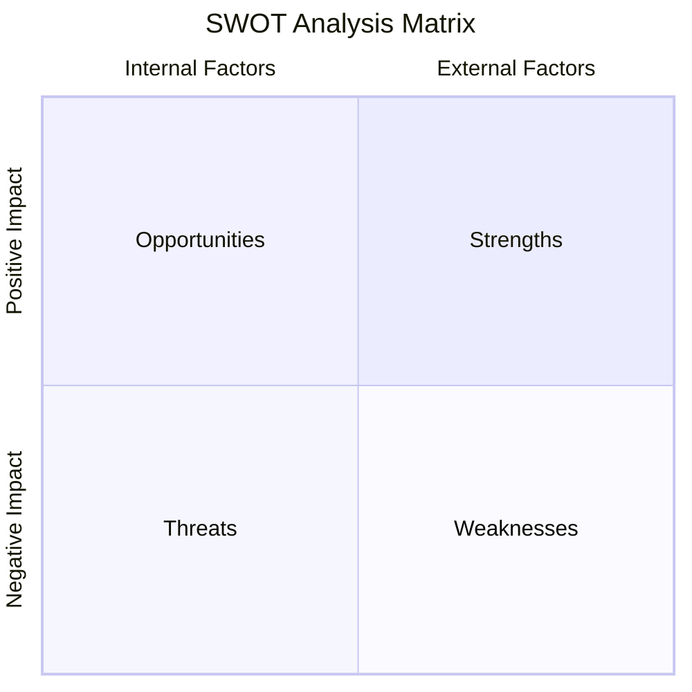

# SWOT Analysis: Bigfoot Blueprint Portfolio Framework

This document evaluates the strengths, weaknesses, opportunities, and threats (SWOT) of the [bigfoot-blueprint-framework.md](file:///c:/Users/tamo4/git/neal-os/03-frameworks/bigfoot-blueprint/source/bigfoot-blueprint-framework.md) in achieving the macro goal: launching 3–5 sites/month, maintaining <$50/launch and <$100/mo overhead, and scaling to 5–10 active Phase 2 directories within 12 months.

---

---

## 1. Strengths (Internal Capabilities)

* **Asymmetrical Risk/Reward (Zero Fixed Cost)**: By hosting static Astro sites on Vercel/Netlify with file-based SQLite databases, the ongoing operating cost of a Stage 1 directory is $0. The only financial risk per launch is the $10–$15 domain registration fee.
* **Speed to Market (The Astro Boilerplate)**: Standardizing a single Next.js/Astro template means Rodrigo only needs to change the database file and brand colors for each new launch. This boilerplate serves as a structural layout framework, allowing us to quickly implement unique visual UI/UX changes (fonts, custom styling, layout nuances) to meet the specific expectations of each niche.
* **AEO & SEO Schema Optimization**: The template programmatically injects rich JSON-LD (`LocalBusiness`, `LegalService`, `FAQPage`, `Speakable`) and flat URL hierarchies, giving the pages a technical edge for indexing by both Google search bots and AI voice agents (ChatGPT, Claude).
* **Niche-Specific One-Stop-Shops**: Rather than relying on a rigid real estate dataset (like Zillow), listing pages are designed to satisfy the specific search and answer intent of the directory's target audience, pulling in exactly what they need to make hiring or buying decisions.

---

## 2. Weaknesses (Internal Vulnerabilities)

* **Stage 2 Operational Drag (Mitigated & Revenue-Backed)**: Managing claimed profiles, manually verifying E&O/COIs, and handling escalations introduces human friction. However, much of this can be streamlined via custom automations (e.g., GHL workflows, automated alerts). Any remaining manual drag is backed by direct incoming revenue, making the operational trade profitable.
* **Developer Setup Overhead for Upgrades (Acceptable Friction)**: Upgrading a site to Stage 2 requires Rodrigo to manually provision a Supabase project, set up RLS policies, migrate SQLite data, and configure environment variables. This setup drag is acceptable given the selective nature of Stage 2 upgrades.
* **Data Ingestion & Scraper Fragility (Defensibility Moat)**: Government registries (State Bar, SOS, Environmental Health portals) are notoriously fragile and scrapers will break. However, this is acceptable friction because it deters low-skilled, lazy competitors, turning scraper maintenance into a proprietary data moat.

---

## 3. Opportunities (External Leverage)

* **The AI Search Shift (AEO/GEO)**: Large Language Models and AI search engines (Perplexity, ChatGPT Search) are actively pulling structured data. Our high-density, schema-rich pages are built specifically to serve as citation pools for these engines.
* **High-Ticket B2B Lead Arbitrage**: Targeting highly fragmented, high-transaction niches (Closing Attorneys/Title Agents, commercial septic, grease traps) allows for premium lead fees ($50–$250/lead) and affiliate commissions that dwarf standard residential B2C directory margins.
* **Core Brand Cross-Promotion**: Directories can act as free customer acquisition channels for your core businesses:
  * *S-Corp Bookkeepers Directory* -> Funnel leads to **Tax Sherpa** Fractional CFO services.
  * *ADU/Zoning Directory* -> Funnel leads to **Resilient Roots** land sales.

---

## 4. Threats (External Risks)

* **Google Programmatic SEO Crackdowns**: Google’s search quality algorithm continuously updates to target mass-produced programmatic content. We mitigate this by ensuring each listing and landing page is rich, comprehensive, and contains deep semantic value to prevent sandboxing.
* **Supabase Free-Tier Changes (Acceptable Risk)**: If Supabase changes its free-tier model, it could increase fixed operating costs, but this remains a low-probability, acceptable risk.
* **Vendor Disengagement (GSC Fallback)**: In highly offline trades, vendors may ignore "Claim your profile" emails. However, the GSC parallel path serves as a validation fallback—if the site gains significant organic traffic first, we can fund direct outreach or telephone sales using that validation data.
