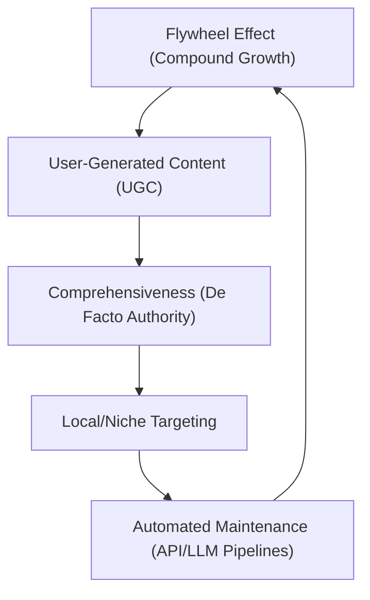
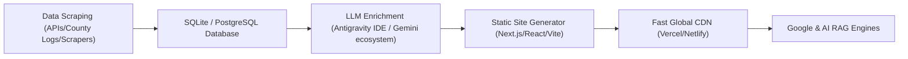
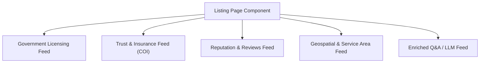
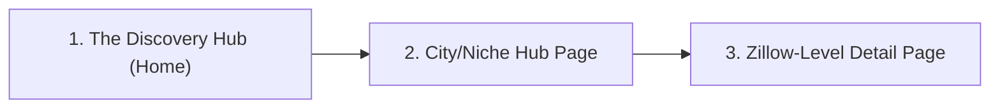
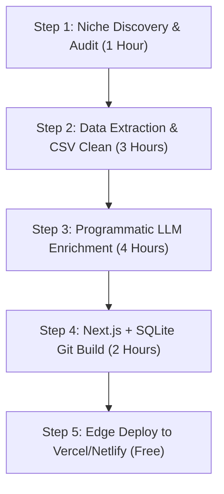
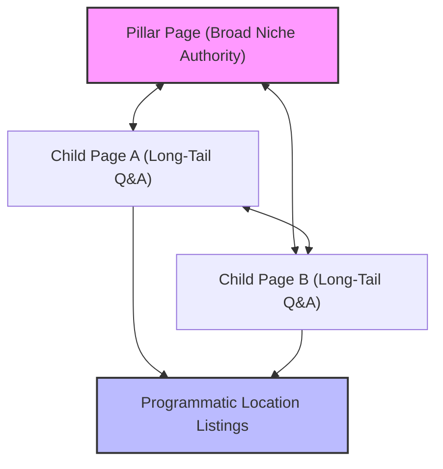
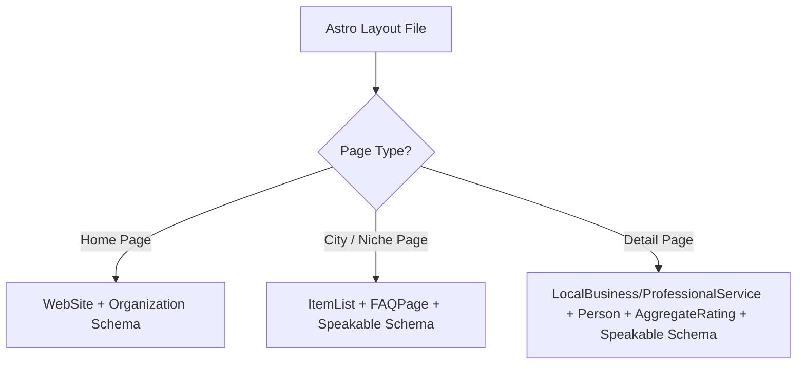
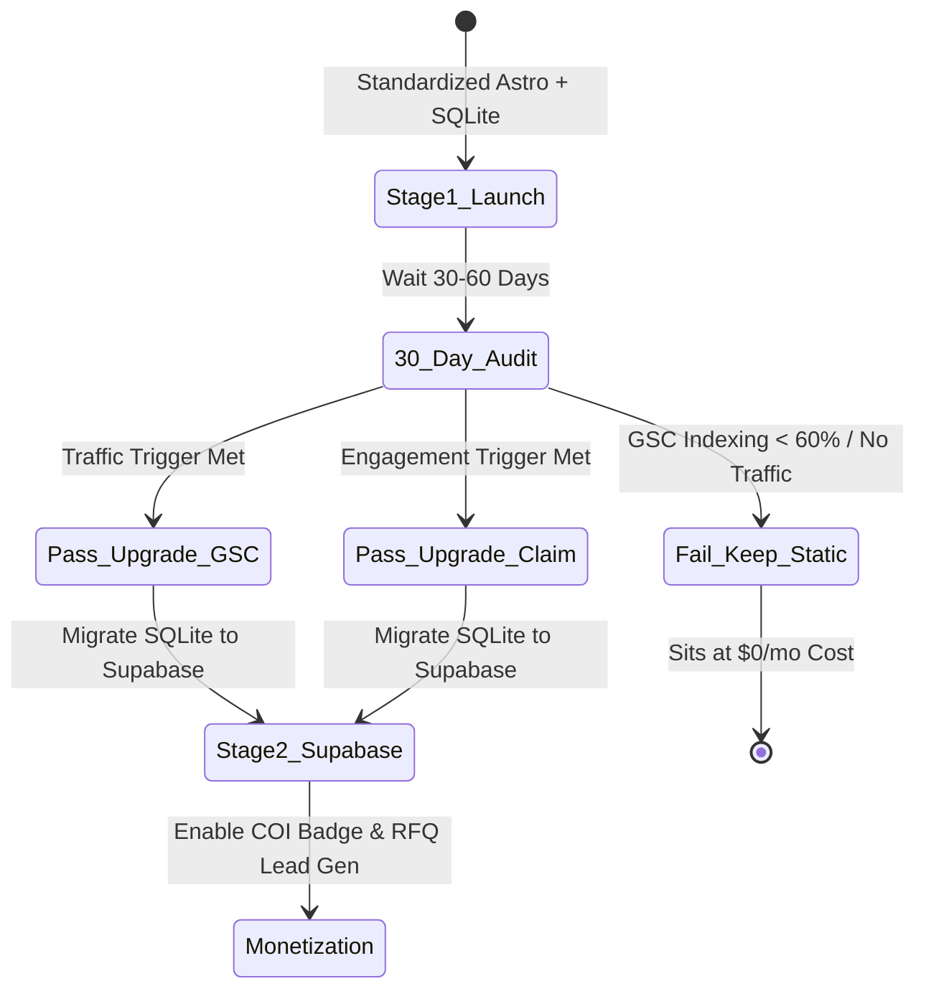
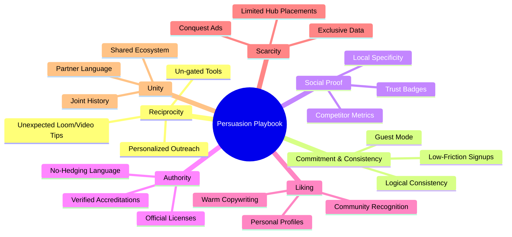

# Bigfoot Blueprint Framework (Niche Directory Sites)

This framework outlines the strategy, logic, and operational architecture for building programmatic niche directory websites as high-leverage assets.

---

## 1. Core Objectives & Thesis

Traditional blogs and text-heavy sites are losing ground due to Search Generative Experience (SGE) and AI-driven search (ChatGPT, Claude, Perplexity). Directories offer structured, queryable data that feeds these LLM engines while providing high-utility tools for human decision-making.

### The 1-vs-10,000 Principle
* **Traditional Blog:** One blogger writing individual posts targeting a single keyword or topic. If the blogger stops writing, growth halts.
* **Directory Asset:** A programmatic system generating thousands (or tens of thousands) of highly specific, structured pages. Instead of one loudest voice, it is "10,000 tiny voices" capturing highly specific, long-tail search volume and AI RAG chunk retrievals.

---

## 2. The Five Moats of Directories

A directory is not just a digital Yellow Pages (which Google penalizes as "thin content"). It must be an enriched, defensible asset protected by five compounding moats:



### Moat 1: The Flywheel Effect
More listings attract more traffic, which attracts more businesses wanting to list. This compounds to drive organic citations, reviews, and backlinks without paid acquisition.

### Moat 2: User-Generated Content (UGC)
By letting businesses claim, verify, and enhance their listings (uploading photos, updating hours, adding bios), and allowing consumers to leave reviews, the community builds the content for you. 

### Moat 3: Comprehensiveness
A directory must list *every* entity in its niche (e.g., all 45,000 nail salons, all dog breeds, or all government contract RFPs). Google and AI engines prioritize complete, reliable sources over partial lists.

### Moat 4: Local & Niche Specificity (The Urgency Multiplier)
Do not compete with general giants (like Yelp or Google Maps). Target highly specific search intent (e.g., "vegan catering in Tulsa," "access-friendly cabins in North Georgia," or "cash-pay physical therapists"). 
* **The Urgency Multiplier**: Prioritize niches where buyers face high urgency or an immediate need (e.g., grease trap backups, emergency HVAC). Stressed buyers need instant, structured utility rather than long-form blog research. Highly specific directories earn higher trust and better conversion rates than generic search engines.

### Moat 5: Automated Maintenance
Use APIs, RSS feeds, and LLM-driven pipelines to auto-refresh data, scrape new locations, and filter spam. The site remains active and updated while the owner goes offline.

---

## 3. The Four Directory Families

Directories generally fall into four structural categories:

| Family | Focus | Examples | Ingestion Source |
| :--- | :--- | :--- | :--- |
| **People** | Profiles, credentials, specialties | Doctors, painters, virtual assistants, legal experts | Licensing boards, professional associations, LinkedIn |
| **Places** | Physical locations, zoning, facilities | Farmers' markets, hot springs, ADU-friendly lots, clinics | Google Places API, municipal databases, land registries |
| **Organizations** | Groups, clubs, networks, associations | Kosher delis, non-profits, specialized equipment repair | Secretary of State files, chamber registries |
| **Time-Bound** | Events, jobs, grants, proposals | Conferences, local concerts, RFPs, academic scholarships | Ticketmaster API, Eventbrite, government grant feeds |

---

## 4. The 16+ Monetization Stack

A mature directory provides multiple distinct monetization pathways, categorized by maturity level:

### Level 1: Primary Placement (Low Complexity)
1. **Paid/Premium Listings:** Charge businesses a monthly subscription ($20–$100/mo) for featured placement, verified badges (e.g., Certificate of Insurance (COI) verification / "Verified Insured" status), or enhanced profile fields (videos, social links).
2. **Premium Placements / Conquest Ads:** Allow competitors to buy banner or inline ads on basic listings (e.g., placing an ad for "Dentist B" on "Dentist A's" profile page).
3. **Programmatic Ads:** Monetize bulk traffic using AdSense, Ezoic, or Raptive.


### Level 2: Lead Gen & Data Licensing (Medium Complexity)
4. **Lead Generation / RFQ (Request for Quote):** Place quote request forms on listing pages. Sell leads back to verified businesses (e.g., $30–$300 per lead depending on contract value).
5. **Private Data Licensing (API Access) & Brokerage:** License your structured, cleaned dataset to larger companies, CRM providers, or B2B platforms seeking specialized data feeds. Build an **API Trust Score** (scoring server uptime, data accuracy, latency, and documentation quality) to validate your API's reliability to enterprise buyers.
6. **Data Reports & Insights:** Package industry trends, salary data, or market analysis into paid PDF downloads.
7. **Job Boards:** Charge companies to post job openings targeting your highly specialized audience.

### Level 3: Transactional & Compound Assets (High Complexity)
8. **Marketplace Commissions:** Transition the directory into a marketplace, taking a transaction fee (e.g., booking excursions, reserving spaces, buying products).
9. **Financing Commissions (Line of Credit):** Partner with lenders to offer financing on high-ticket B2B transactions made via your platform (e.g., wholesale financing commissions).
10. **Hosted Webinars & Sponsored Content:** Charge major industry brands (e.g., Caterpillar, Ford, or software giants) to broadcast to your directory's email list or host virtual workshops.
11. **Email List Renting (Sponsorships):** Charge brands to send dedicated promotional emails to your newsletter subscribers.
12. **Affiliate Marketing:** Recommend products/services relevant to the directory (e.g., tools for painters, dog food for specific breeds).
13. **Print-on-Demand Swag:** Sell niche-specific physical merchandise.
14. **Training & Certification Programs:** Sell educational programs to professionals listed in the directory to help them get certified and receive special badges.
15. **Association Memberships:** Convert directory members into a formal professional association with recurring dues, private community forums, and member benefits.
16. **Software-as-a-Service (SaaS) Upgrades:** Offer proprietary software utilities (e.g., booking engines, reviews managers, or AI call agents) to listed businesses.

---

## 5. Programmatic Tech Stack (Bypassing Replit & WordPress)

For scale, speed, and clean data custody, avoid heavy WordPress plugins or transient Replit containers. Use a custom, decoupled architecture optimized for sub-100ms load speeds and rich schema injection:



### Component 1: Ingestion & Storage
* **Source Feeds:** Google Places API, county tax logs, government API directories, custom HTML/PDF scrapers, or **PowerBI interactive dashboards** (e.g., `app.powerbigov.us` extracted via Playwright DOM scrolling).
  * **Apify Actor Architecture:** When building custom scrapers, use the Two-Bot approach (Bot #1 architects the schema, Bot #2 builds the actor). Ensure the resulting Apify Actor follows standard architecture: `package.json`, `input_schema.json`, `main.js` (orchestration), `validate.js` (data checks), and `transform.js` (formatting). Route seeds and output data through Apify Key-Value Stores.
* **Database:** **SQLite** for smaller, self-contained niche sites (easy to commit to Git and deploy); **Multi-Tenant Supabase** (PostgreSQL cloud database with directory_id tenant partitioning) for Stage 2 directories requiring parallel write operations or complex relational queries.

### Component 2: LLM Enrichment Pipeline
* **Scripting:** Python or Node.js scripts running offline or via cron tasks to clean, categorize, and enrich database records.
* **Enrichment Logic (AI Engine Mechanics):** AI crawlers (like Perplexity and ChatGPT) do not scrape tabular data well; they require direct, conversational, authoritative answers. Pass raw tabular records through the Gemini ecosystem (e.g., Gemini 2.5 Flash / Pro) natively inside the Antigravity IDE to enrich the data into conversational "Top 20 Questions" Q&A blocks. This avoids external token costs and allows full enrichment for all Stage 1 listings.
* **Programmatic Armor:** To immunize against Google's "thin content" penalties, generate extremely deep schemas per listing (e.g., 93+ distinct data fields), mimicking the depth of an investigative journalist.
* **JSON Schema Generation:** Programmatically generate structural JSON-LD schema (e.g., `LocalBusiness`, `Product`, `Event`) for every page, ensuring search engine bots and AI scrapers can parse the data perfectly.

### Component 3: The Front-End (Decoupled & Fast)
* **Recommended Framework:** **Astro** (with static site generation / SSG).
  * *Why Astro*: Astro ships zero client-side JavaScript by default, resulting in perfect 100/100 Lighthouse scores and sub-50ms Edge load speeds. This maximizes crawl budgets and AI search scraper indexing efficiency.
  * *Alternative*: Next.js (App Router) if the site requires complex dynamic state throughout all client views from Day 1.
* **Hosting**: Deploy to edge CDN platforms (Vercel, Netlify, or Cloudflare Pages).
* **Design Philosophy**: Clean, content-focused glassmorphic or minimalist UI/UX. Speed and data density are prioritized to maximize search crawling efficiency and user retention.


---

## 6. Zillow-Level Listing Page Architecture (Multi-Feed Integration)

To bypass programmatic "thin content" filters and establish absolute authority with search engines and AI agents, individual listing pages must act as unified portals integrating multiple distinct data streams, mimicking Zillow's listing aggregation model:



### Integrated Data Feeds
1. **Licensing & Regulatory Feed**:
   * Official license number, issuer, current status, active disciplinary actions, and renewal history.
   * **Source**: Direct automated scrapers targeting state licensing boards or professional registries.

2. **Trust & Insurance Feed (Premium/Tiered Option)**:
   * Certificates of Insurance (COI) tracking, policy coverage limits, insurer information, and expiration dates.
   * **Source**: Verified vendor uploads or API bridges to compliance tracking databases.

3. **Reputation & Review Feed**:
   * Aggregated ratings and snippets from major platforms (Google Places, Facebook, etc.) paired with native directory-specific customer reviews.
   * **Source**: Places API and custom database review entries.

4. **Geospatial & Service Area Feed**:
   * Interactive maps (Google Maps/Mapbox), precise physical coordinates, and defined polygon or zip-code service radius maps.
   * **Source**: Geolocation APIs and custom polygon mapping tools.

5. **Operational & Enriched Q&A Feed**:
   * Detailed hours, payment methods accepted, emergency dispatch capabilities, and the customized LLM-enriched answers to the niche's top 20 questions.
   * **Source**: Internal SQLite database enriched via offline LLM pipelines.

---

## 7. Hosting & Database Lifecycle Path (Cost Optimization)

To maintain the economics of the "ships-in-the-water" quantity play, directories must progress through a structured hosting and database lifecycle, minimizing initial setup friction and operating overhead:

| Stage | Database | Hosting | Dynamic Writes | Cost |
| :--- | :--- | :--- | :--- | :--- |
| **Stage 1: Launch (Static)** | **SQLite File** (committed to Git repo) | **Vercel / Netlify** (SSG) | Disabled (read-only) | $0/mo |
| **Stage 2: Upgrade (Dynamic)** | **Multi-Tenant Supabase** (PostgreSQL cloud database, directory_id partitioned) | **Vercel / Netlify** (ISR/SSR) | Enabled (reviews, claiming, COI/OCR uploads) | $0 to $25/mo |
| **Stage 3: Enterprise** | **Railway Postgres / Supabase** | **Railway / Vercel** | Enabled (complex workflows, dispatch APIs) | Variable |

### Stage 1: The Bootstrapping Phase (Zero-Cost & Fast)
* **Goal**: Launch 10–20 niche directories as fast as possible to index in search and gather initial traffic data.
* **Architecture**: The SQLite database sits directly in the code repository. During the git-triggered build on Vercel/Netlify, the Next.js builder queries the SQLite file, pre-renders all listing pages statically, and deploys them to the Edge.
* **Why**: The database is zero-setup for the developer, and the site is free to host indefinitely.

### Stage 2: The Validation Phase (Migrating to Multi-Tenant Supabase)
* **Goal**: Enable user-generated content (reviews, profile claiming, image uploads) on directories that have validated search traffic.
* **Architecture**: When a directory receives consistent traffic or lead submissions, Rodrigo runs a script to migrate the SQLite schema and data to a consolidated **Multi-Tenant Supabase instance** (where the individual directory acts as the tenant and is partitioned by a `directory_id` column). This allows us to run up to 10+ validated directories on a single $25/mo Supabase Pro plan. The Next.js frontend is updated to fetch dynamic data and handle user writes.
* **Why**: You only spend time migrating and paying for database resources on winning directories, while keeping multi-site database costs consolidated under $25/mo.

---

## 8. Bootstrapping KPIs & Success Metrics (Stage 1 Validation Gate)

To determine which "ships" have successfully navigated the indexing/sandbox phase and are ready to be upgraded to Stage 2 (dynamic backend), we track five key performance indicators (KPIs) over a 60-to-90-day window:

| KPI Metric | Target Threshold | Source / Verification Tool |
| :--- | :--- | :--- |
| **1. Indexing Rate** | **> 60%** of total generated pages indexed | Google Search Console (GSC) |
| **2. Search Impressions** | **> 500 impressions/week** (steady upward slope) | GSC Search Performance Report |
| **3. Organic Clicks** | **> 20 high-intent clicks/week** | GSC Search Performance Report |
| **4. AI Agent Citations** | Domain cited in **> 2 test queries** on target Q&A | Perplexity, ChatGPT Search, or Gemini |
| **5. Passive Intent Actions** | **> 3 lead submissions / claims** in a 30-day period | Webhook logs (Formspree / GoHighLevel) |

### Triggering the Stage 2 Upgrade
A directory ship is promoted to **Stage 2 (Dynamic Supabase integration)** as soon as it meets either of the following criteria:
1. **The Engagement Trigger**: Receives a minimum of 2 organic "Claim my Listing" form submissions from business owners seeking to verify their profiles.
2. **The Traffic Trigger**: Achieves the combined target threshold for both *Search Impressions* and *Organic Clicks* for three consecutive weeks, validating that Google has ranked the directory for high-intent long-tail keywords.

---

## 9. Double-Sided UI/UX & Repeatable Site Architecture

To address the double-sided market challenge (providing high value to the searcher while incentivizing the business owner to claim their profile), the directory is structured around a standardized page layout and psychological trust triggers.

### A. The Double-Sided Design Philosophy
* **For the Searcher (Intuitive & Useful)**:
  * **Zero Clutter**: Clean, minimalist glassmorphic interface focusing purely on data density.
  * **Quick Vetting**: Standardized badges ("Licensed," "COI Verified," "Top Rated") in the primary viewport so the user can compare vendors in seconds.
  * **Action-First**: An omnipresent "Request Quote" or "Check Booking Availability" button on every page.
* **For the Listing Owner (The Claiming Incentive)**:
  * **Neutral Default State**: Regular unclaimed profiles display NO negative "unverified" or "unclaimed" badges, flags, or alerts to the public. The business details are presented neutrally to preserve accuracy and trust.
  * **The "Locked Value" Preview**: The listing details display placeholders for premium features (e.g., "Owner Video Walkthrough," "Social Links," "Special Offers") showing exactly what the business is missing out on by remaining on the free, neutral tier.
  * **Loss Aversion (Conquest Ads)**: Unclaimed profiles may display ads for competitor agencies or verified alternatives. To remove competitor ads and gain a verified premium badge, the business must claim the profile and upgrade.

---

### B. Standardized 3-View Site Architecture

Every directory "ship" launched uses a repeatable front-end routing template composed of three primary page views:



#### View 1: The Discovery Hub (Home Page)
* **Goal**: Immediate search indexing and brand credibility.
* **Layout**:
  * **Primary Viewport**: Niche-specific search bar ("Find a closing attorney in...") overlaid on a high-quality background graphic.
  * **Secondary Viewport**: Interactive map showing pins of all active listings nationwide/statewide.
  * **Category Grids**: Fast-access filter buttons based on specialized services (e.g., "Double Closings," "Probate Specialist," "Commercial").

#### View 2: The City/Niche Hub Page (The SEO Honey Pot)
* **Goal**: Target localized, intent-based searches (e.g., `/ga/macon-grease-traps`).
* **Layout**:
  * **Top Section**: High-density list of the top-rated local providers in that specific geography.
  * **Editorial Compliance Section**: A native HTML `<details>` accordion explaining local regulations (e.g., *"Macon Grease Discharge Code Section 12"*). This satisfies Google's helpful content criteria and feeds AI engine search queries.
  * **Quick Quote Widget**: A lead form that broadcasts queries to all local providers in that specific city.

#### View 3: The Zillow-Level Detail Page (The Profile)
* **Goal**: Convert searchers into leads and incentivize owners to claim profiles.
* **Layout**:
  * **Header Card**: Company name, license status badge, and "Claim Profile" CTA.
  * **Splitscreen Layout**:
    * *Left Column (Static & Rich)*: Government license records, physical address map, service radius polygon, and LLM-enriched Q&A.
    * *Right Column (Dynamic CTAs)*: Interactive booking widget, native reviews panel, and paid/premium upgrade modules.

---

## 10. Niche Ingestion & Rapid Bootstrapping Workflow (The 48-Hour Blueprint)

To execute the quantity play successfully, Rodrigo must follow a standardized, free-tier-optimized pipeline to go from a niche idea to a live, indexed site in under 48 hours:



### Step 1: Niche Discovery, Keyword Audit & Geo-Multiplexing Plan (Time: 1 Hour)
* **Action**: Identify a fragmented market and map out the core educational topics:
  1. *Registry Audit*: Is there an easily exportable state/county registry of licensed entities? (e.g., HVAC, Closing Attorneys, Septic Haulers).
  2. *Digital Footprint Audit*: Do the local competitors have poor digital footprints? (Average website is outdated or non-existent).
  3. *Viability Scorecard*: Evaluate the niche's commercial viability using these three filters:
     * **Demand Concentration**: Can you easily identify the buyer persona? (e.g., Facility Managers vs. "Everyone"). Highly concentrated B2B buyers make outreach cheaper and faster.
     * **Recurring Need (Scale vs. Frequency Equation)**: Is this service compliance-driven or recurring (e.g., pumping grease traps quarterly)? Recurring need builds recurring traffic and higher LTV. However, a low-frequency need (e.g., a well pump replacement every 15 years) can still be highly viable if offset by massive Geographic Scale (nationwide vs. local). The viability is calculated as: `Sustainable Lead Volume = Purchase Frequency × Geographic Scale`.
     * **Avatar Adjacency Cluster (Expansion Modifier)**: When evaluating a niche, identify the core buyer persona (the "avatar") and map out their other associated problems. For example, a new restaurant owner (the avatar) needs Grease Trap Pumping, but also needs Fire Suppression Inspections, Hood \u0026 Exhaust Cleaning, and Commercial Pest Control. A niche that forms the foundation of a "Directory Cluster" targeting the exact same avatar receives a massive positive modifier, as you can cross-pollinate traffic and leads across your portfolio.
  4. *Head-Term Keyword Research*: Run programmatic search queries using the **AnswerThePublic API** via the shared CLI script (`02-workbench/answerthepublic/scripts/fetch-atp.py`) to extract real search queries, questions, and comparisons. These queries are cached locally in `02-workbench/answerthepublic/cache/` to avoid redundant credit consumption (limit to 10 or fewer searches per directory launch to conserve plan credits).
  5. *Geo-Intent Multiplexing Setup*: Plan the programmatic combination of these broad educational head queries with target geographic locations (e.g., combining *"grease trap requirements"* + *"Macon, Georgia"* into a single, high-intent local educational page: *"What are the requirements for cleaning grease traps in Macon, Georgia?"*).


### Step 2: Data Extraction & Cleaning (Time: 3 Hours)
* **Action**: Scrape or extract data from public registry directories (e.g., state/county licensing boards, regardless of whether they are formatted as clean CSVs, messy HTML tables, or PDFs).
* **Execution**: 
  * Deploy **Antigravity automations or inexpensive Apify actors** to parse and clean the registries. Extract fields like: Business Name, License Number, License Status, Physical Address, Phone, and Principal Owner.
  * Format coordinates (Latitude/Longitude) by passing addresses through a free geocoding API.

### Step 3: Programmatic LLM Enrichment (Time: 4 Hours)
* **Action**: Enrich the database with high-value answers to the "Top 20 Questions."
* **Execution**:
  * Run the enrichment programmatically **inside the Antigravity IDE/environment** using the user's Google AI Ultra subscription (Gemini 2.5 Flash / Pro).
  * Pass raw listings in JSON arrays. System Prompt: *"Analyze this business profile. Answer the top 20 questions based on typical services offered in this location... Output in clean JSON format."* Since there is no token billing constraint under this subscription, perform the full 20-question profile enrichment for all listings starting in Stage 1.
  * Save the enriched output directly into a local `directory.sqlite` database file.

### Step 4: Astro SQLite Git Build (Time: 2 Hours)
* **Action**: Inject the SQLite file into the standardized Astro directory code template.
* **Execution**:
  * Place `directory.sqlite` inside the Astro project's data directory.
  * Run `npm run build` locally. The Astro compiler queries the SQLite database at build time, generates 100% static, optimized HTML pages for every city and listing, and writes them to the output directory.
  * Verify schema injection (`JSON-LD` LocalBusiness schema is present in head tags).
  * Commit the code and database to a new private GitHub repository.


### Step 5: Edge Deploy to Vercel/Netlify (Time: 1 Hour - Free)
* **Action**: Connect the GitHub repository to a free Vercel or Netlify project.
* **Execution**:
  * Set project name (e.g., `macon-septic-guide`).
  * Click deploy. The platform pulls the repo, builds the static HTML, and distributes it to edge CDNs worldwide.
  * Register the new domain (or subdomain) in Vercel settings and add the project to the central tracking registry in `/02-workbench/nhq-bigfoot-blueprint/directory-registry.md`.

---

## 11. SEO & AEO Content Architecture (Flat Pillar-and-Silo Model)

To rank for high-intent long-tail search queries and serve as an authoritative source for AI engine retrievals, the programmatic listing pages must be paired with hard-coded editorial education pages. These pages follow a strict internal linking hierarchy combined with a flat URL slug structure.

### A. The Flat URL Hierarchy
To maximize crawl efficiency, eliminate crawl-depth penalties, and pass link equity directly, avoid nested directories (like `/articles/grease/georgia-compliance`). All editorial pages use a flat structure:
* **Pillar URL**: `domain.com/georgia-grease-trap-rules`
* **Child URL**: `domain.com/macon-grease-trap-frequency`
* **Listing URL**: `domain.com/macon-septic-pumping`

---

### B. The Internal Semantic Silo Linking Model
While the URL structure is flat to search engine crawlers, the **internal links** within the page copy follow a strict hierarchical silo to maintain semantic focus:



1. **Vertical Bidirectional Linking**:
   * Every **Child Page** must link back up to its parent **Pillar Page** using exact-match or broad-match anchor text (e.g., in a Macon compliance article, link back to the main Georgia compliance guide).
   * The parent **Pillar Page** must link down to every **Child Page** in its silo (usually organized in a resource list or inline context).

2. **Lateral In-Silo Linking**:
   * Child pages within the same silo can link to each other when relevant (e.g., the article on "Fines for Grease Violations" links to "How Often to Pump Grease Traps").
   * **Rule**: Child pages must *never* link to pages in other editorial silos. This keeps the semantic crawlers (and AI bots trying to parse context) tightly bound to the topic.

3. **Funneling Authority to Directory Listings**:
   * Both Pillar and Child pages must strategically link to the relevant programmatic listing pages (e.g., in the Macon compliance article, link to the Macon listings directory `/macon-grease-traps`). This funnels search equity to the transaction-ready directory listings.

---

### C. Geo-Intent Multiplexing & Implicit vs. Explicit Search (The "Full Buffet" Strategy)
To build a comprehensive semantic map that captures the full spectrum of user behavior across Google and AI search engines, the content pipeline must serve a "full buffet" of both general (implicit) and localized (explicit) educational pages:

1. **Implicit Localized Pages (General Head-Term & Educational Pages)**:
   * **Target Queries**: Users searching for broad queries without geo-locators (e.g., *"how often to clean a grease trap"* or *"grease trap cleaning guides"*).
   * **URL Slugs**: Flat, general slugs (e.g., `domain.com/how-often-to-clean-grease-traps`).
   * **The Mechanics**: These pages establish the macro-topic authority. When a user located in Macon searches for "grease trap cleaning," Google or an AI engine personalizes the response by reading their IP or geo-data, parsing our site's semantic map, and serving this general page or routing them to local directory cards.

2. **Explicit Localized Pages (Geo-Multiplexed Pages)**:
   * **Target Queries**: Users searching for queries with explicit geo-locators (e.g., *"grease trap cleaning Macon Georgia"* or *"requirements for grease traps in Bibb County"*).
   * **URL Slugs**: Flat, geo-qualified slugs (e.g., `domain.com/macon-grease-trap-requirements`).
   * **The Mechanics**: Programmatically merges the head-term questions with local database variables (State, County, City, local municipal code references).

### The Template Architecture
Every educational page uses a standardized MDX layout containing:
1. **Static Niche Guide**: Broad advice on how the service works, why it matters, and general compliance guidelines.
2. **Dynamic Geo-Tokens (Omitted on Implicit Pages)**: Programmatically injected municipal codes, local contact details for regional code inspectors, and local service providers queried from the SQLite database (rendered only on explicit geo-pages).
3. **Silo Links**: Links back to the state-level Pillar Page and out to the `/macon-grease-traps` listings page to pass organic weight.


---

## 12. JSON-LD Schema Architecture by Page Type (SEO & Voice AEO)

To maximize visibility in traditional search engines and ensure indexing by voice agents (e.g., ChatGPT Voice, Claude read-aloud), every page rendered by Astro must programmatically inject structured JSON-LD schema into the HTML head tag.



### 1. View 1: The Discovery Hub (Home Page)
* **Objective**: Define the identity of the directory brand.
* **JSON-LD Schema**:
  * `WebSite`: Declares the search engine relationship, name, and URL.
  * `Organization` (or `Brand`): Declares the owning entity (e.g., M&N iProperty or Resilient Roots).
* **Target Schema Example**:
  ```json
  {
    "@context": "https://schema.org",
    "@type": "WebSite",
    "name": "Georgia Closing Lawyer Directory",
    "url": "https://georgiaclosinglawyers.com",
    "publisher": {
      "@type": "Organization",
      "name": "M and N iProperty Group",
      "logo": "https://georgiaclosinglawyers.com/logo.png"
    }
  }
  ```

---

### 2. View 2: The City/Niche Hub Page (Editorial / FAQ)
* **Objective**: Aggregate local listings and expose localized regulatory Q&As to search engines and voice crawlers.
* **JSON-LD Schema**:
  * `ItemList`: Lists all local businesses displayed on the page, passing structural indexing signals.
  * `FAQPage`: Exposes the Q&A items programmatically.
  * `Speakable`: Points to the CSS selectors of the compliance Q&A text to identify it as ideal for text-to-speech rendering by AI voice agents.
* **Target Schema Example**:
  ```json
  {
    "@context": "https://schema.org",
    "@type": "FAQPage",
    "mainEntity": [{
      "@type": "Question",
      "name": "What are the grease trap pumping requirements in Macon?",
      "acceptedAnswer": {
        "@type": "Answer",
        "text": "Macon requires commercial kitchens to pump grease traps quarterly or when 25% full, whichever occurs first."
      }
    }],
    "speakable": {
      "@type": "SpeakableSpecification",
      "cssSelector": [".faq-answer"]
    }
  }
  ```

---

### 3. View 3: The Zillow-Level Detail Page (The Profile)
* **Objective**: Verify the professional, license, rating, and location data of the specific listing.
* **JSON-LD Schema**:
  * `LocalBusiness` (for physical trades like Septic/HVAC) or `ProfessionalService` / `LegalService` (for Attorneys).
  * `Person` (for individual service providers like closing attorneys, nested within the parent service).
  * `AggregateRating` and `Review`: Captures local reputation metrics.
  * `Speakable`: Targets the enriched LLM profile summaries.
* **Target Schema Example**:
  ```json
  {
    "@context": "https://schema.org",
    "@type": "LegalService",
    "name": "Macon Closing Law Offices",
    "image": "https://georgiaclosinglawyers.com/images/macon-office.jpg",
    "address": {
      "@type": "PostalAddress",
      "streetAddress": "123 Cherry St",
      "addressLocality": "Macon",
      "addressRegion": "GA",
      "postalCode": "31201"
    },
    "telephone": "+14785550199",
    "openingHours": "Mo-Fr 09:00-17:00",
    "priceRange": "$$$",
    "geo": {
      "@type": "GeoCoordinates",
      "latitude": 32.8407,
      "longitude": -83.6324
    },
    "employee": {
      "@type": "Person",
      "name": "Jane Doe, Esq.",
      "jobTitle": "Closing Attorney"
    },
    "aggregateRating": {
      "@type": "AggregateRating",
      "ratingValue": "4.8",
      "reviewCount": "24"
    }
  }
  ```

---

## 13. Portfolio Macro Goal: The Phase 2 Acceleration Engine

The overriding goal of this operating framework is to build, test, and scale a portfolio of niche directory assets, accelerating them to **Phase 2 (Lead Gen & Claimed Premium Profiles)** as rapidly and cost-effectively as possible.

### A. The Portfolio Targets
* **12-Month Target**: Establish a portfolio of **at least 5–10 active, verified Phase 2 directories** generating recurring revenue.
* **Operating Overhead**: Limit total ongoing directory portfolio overhead to **<$100/month** by keeping unvalidated Stage 1 "ships" on free static tiers (Vercel/Netlify).
* **Launch Velocity**: Deploy **3–5 new Stage 1 directories ("ships") per month** using our standardized Astro template, keeping the bootstrapping cost to **<$50** (domain fees) and **<10 hours** of developer (Rodrigo) time per launch.

---

### B. The Acceleration Engine Loop
To hit these targets, the portfolio follows a continuous feedback-loop cycle managed by your developer and assistant:



1. **The Ingestion Funnel**:
   * Identify niches, extract public registries, and run the Python LLM enrichment script.
   * Push to GitHub and auto-deploy to Vercel/Netlify for free.

2. **The 30-Day Audit**:
   * Review Google Search Console (GSC) for indexing rates and search query impressions.
   * Audit incoming email/GHL notifications for listing claim inquiries.

3. **The Promotion Gate**:
   * **If the Validation triggers are met**: Immediately migrate the SQLite data to the consolidated multi-tenant Supabase instance (under its corresponding `directory_id`), enable dynamic reviews/COI uploads (using OCR validation within the Gemini ecosystem), and launch the targeted B2B outreach campaign (Phase 2).
   * **If the triggers are NOT met**: Keep the site running as a Stage 1 static site at **$0/month**. It remains in the water as a passive asset, gathering search history and building domain age.

---

## 14. Value-First & Interactive Utility (Hormozi Reciprocity Playbook)

To maximize conversion and build deep trust before introducing any monetization barriers, every directory must deliver immediate, obvious utility using **Alex Hormozi's Value Equation**:

$$\text{Value} = \frac{\text{Dream Outcome} \times \text{Perceived Likelihood of Achievement}}{\text{Time Delay} \times \text{Effort \& Sacrifice}}$$

Our directories optimize this equation by placing **free interactive tools and calculators** in the primary viewport, minimizing the *time delay* and *effort/sacrifice* required for the user to get answers, thereby triggering the **principle of reciprocity**.

### A. Core Utility Components by Niche Niche

Every directory ship must include at least one free, interactive, client-side calculator (built directly in Astro/vanilla JS to maintain sub-50ms speeds) on its homepage and location landing pages:

| Directory Niche | Target Customer's Core Pain | Free Interactive Tool |
| :--- | :--- | :--- |
| **S-Corp Bookkeepers** | *Are my tax savings worth the overhead of S-Corp status?* | **S-Corp Tax Savings Calculator**: User inputs revenue/profit, and the tool outputs estimated self-employment tax savings and salary vs. distribution allocations instantly. |
| **Closing Attorneys / Title Agents** | *What will my actual closing costs and fees be?* | **Seller Net Sheet & Closing Cost Estimator**: Calculates estimated transfer taxes, title fees, and closing attorney costs by county. |
| **Septic & Grease Trap Services** | *How often am I legally required to pump to avoid fines?* | **Grease Trap Pumping Frequency Calculator**: Estimates regulatory pump schedule based on trap capacity, seating count, and food type (fast food vs. standard). |
| **HVAC & Refrigerant Trade** | *Is it better to repair my old unit or replace it?* | **Repair vs. Replace Unit Calculator**: Calculates energy savings and payback periods of installing a new high-SEER unit vs. ongoing repair costs of an old R-22 system. |

---

### B. The Reciprocity Conversion Loop
1. **Un-gated Value**: The tools require **no email signup or payment** to use. The user gets the calculation result instantly (minimizing Time Delay and Effort).
2. **Immediate Problem Validation**: The result validates the user's need (e.g., *"You will save $4,800/yr by switching to an S-Corp, but you need an S-Corp bookkeeper to run it"*). This raises the **Perceived Likelihood of Achievement** for their dream outcome.
3. **The Frictionless CTA (Phase 2)**: Only *after* the value is delivered does the page present the directory: *"Here are the 3 top-rated, E&O/COI-verified professionals in Macon who can execute this for you. Click here to request a free quote."*

---

## 15. Cialdini's Persuasion Playbook for Niche Directories

To maximize listing claims, lead generation, and user registrations, directories must apply **Robert Cialdini's Seven Principles of Persuasion** to short-circuit user and owner decision fatigue. 



### 1. Reciprocity (Unexpected, Personalized Value)
* **The Principle**: Diners tip 23% more when waitstaff leave an extra mint paired with a personalized gesture (*"I brought you an extra one because you've been great"*). Mass gestures do not trigger reciprocity; unexpected, personal value does.
* **Directory Application**: 
  * **Searcher**: The home page features a fully functional, un-gated calculator. The value is delivered upfront with zero barriers.
  * **Owner (Claiming Funnel)**: During B2B claiming outreach, do not lead with billing pitches. Instead, send a personalized screenshot or a 30-second Loom showing their active listing on the directory (e.g., *"We noticed your profile is active on GeorgiaClosingLawyers.com and ranks for Macon closings. I want to make sure your coordinates and contact details are fully accurate. Claim your listing for free here..."*).

### 2. Commitment & Consistency (The "Guest Mode" Ladder)
* **The Principle**: A tiny, low-stakes commitment (such as a 3-inch safe-driving sticker in a window) alters self-perception, causing a 4.5x increase in compliance for a subsequent high-stakes request (a large, ugly front-yard billboard). 
* **Directory Application**: 
  * **Guest Mode Conversion**: Do not email-gate the calculators. Let users use them wide open. However, overlay a subtle status bar: *"Guest Mode Active. Your calculation history is temporary. Create a free account to save your net sheets, customize client headers, or export PDFs."* Once they take the first small action (running a calculation), they are 76% more likely to create an account to save their state.
  * **Owner Engagement**: Get a small verbal or digital "yes" first (e.g., *"We are verifying active licensees in Bibb County to maintain the directory's standard. Is your license status still active?"*). Once they verify their status, they are primed to complete the full profile claim.

### 3. Social Proof (Neighbor-Based Specificity)
* **The Principle**: Specificity of the reference group dictates influence. A hotel sign stating *"75% of guests who stayed in THIS ROOM reused their towels"* outperforms a generic *"75% of hotel guests"* sign by 33%.
* **Directory Application**:
  * **Local Badges**: Display exact counts of verified local peers (e.g., *"Join 18 other licensed real estate attorneys in Macon-Bibb County on the registry"*).
  * **Claiming Copy**: In outreach, reference specific local competitors: *"90% of closing attorneys in Macon offering mobile closings have verified their listings. Claim your profile to maintain local presence."*
  * **Peer Compliance**: Use visual Trust Badges ("ALTA Best Practices," "Appointed with Chicago Title") to trigger the professional herd effect.

### 4. Authority (Eliminating Hedging Language)
* **The Principle**: Authority cues (like a physician's title) bypass critical evaluation, triggering a 95% compliance rate even for dangerous prescriptions.
* **Directory Application**:
  * **No Hedging**: Avoid tentative language ("You might want to check out these lawyers"). State facts and direct recommendations: *"Based on official licensing board records, Jane Doe, Esq. is a registered real estate attorney in active standing with the State Bar of Georgia."*
  * **Credentials Display**: Prominently display professional designations, state bar registration numbers, and compliance accreditations in the primary viewport.

### 5. Liking (Warm, Human-First Profiles)
* **The Principle**: People buy from those they like and trust. Joe Girard's record of 13,001 car sales was built on sending monthly "I Like You" cards to his client database.
* **Directory Application**:
  * **Approachable Layouts**: Feature professional headshots, friendly personal bios, and video introductions directly on listing pages.
  * **Warm Copy**: Use conversational, customer-centric writing: *"Jane Doe established her Macon practice to help local families navigate probate issues seamlessly."*

### 6. Scarcity & Loss Aversion (Conquest Placements)
* **The Principle**: The pain of losing an asset is twice as powerful as the pleasure of gaining it. Rarity (2 cookies in a jar vs. 10) increases perceived value.
* **Directory Application**:
  * **Conquest Ads**: Unclaimed profiles display neutrally but show ads for local competitor alternatives in the sidebar (Loss Aversion). To remove competitor ads, gain positive verification badges, and lock their profile, the business must claim it.
  * **Inventory Scarcity**: Limit featured spots on city hubs (e.g., *"Only 3 featured attorney slots available for Fulton County this quarter. 2 currently filled"*).

### 7. Unity (Shared Identity & Partnerships)
* **The Principle**: Unity is established when an individual feels the requester is "one of us" (a member of the same family, alma mater, or professional group).
* **Directory Application**:
  * **Ecosystem Framing**: In B2B claiming campaigns, align yourself as a collaborative partner rather than a vendor: *"As part of the Georgia real estate ecosystem, we built this directory to streamline the closing process for local buyers and sellers. Let's work together to keep the local registry accurate."*

---

## 16. Self-Hosted Monorepo Directory Engine Blueprint

For dynamic directory projects requiring complex backend interactions (e.g., dynamic user-generated reviews, profile claiming verification, or automated COI processing) outside of static Astro site generation, we implement a self-hosted monorepo architecture:

### A. The Monorepo Stack
* **Frontend**: React + Vite SPA (`artifacts/directory-master`) configured to run on port 5000.
* **Backend**: Express 5 API Server (`artifacts/api-server`) configured to run on port 8080.
* **Database**: Drizzle ORM + PostgreSQL (`lib/db`).

### B. Express 5 Wildcard Routing Compliance
Express 5 uses `path-to-regexp` v8, which no longer accepts bare `*` wildcards. To prevent 502/404 routing errors on static files, storage assets, and SPA fallbacks, all wildcards must be wrapped in matching parameter brackets:
* **Static Assets / Storage**:
  ```typescript
  // OLD syntax (Express 4)
  router.get("/storage/public-objects/*filePath", handler);
  
  // NEW syntax (Express 5)
  router.get("/storage/public-objects/{*filePath}", handler);
  ```
* **SPA Catch-All Route**:
  ```typescript
  // OLD catch-all
  app.get("*", (req, res) => { ... });
  
  // NEW catch-all
  app.get("/{*wildcard}", (req, res) => {
    res.sendFile(path.join(staticDir, "index.html"));
  });
  ```

### C. Automated Setup Wizard Integration
To eliminate manual setup token steps in developer environments and streamline automated testing:
1. Expose a secure, restricted API endpoint `GET /api/setup/token`.
2. The endpoint must check if the app is already installed (`installed = false` in the database). If not, it returns `{ token: "<current_setup_token>" }`. If already installed, it returns `404 Not Found`.
3. In the React frontend setup wizard (`src/pages/setup.tsx`), default the onboarding state to step 2 (Admin Creation), auto-fetch `/api/setup/token` in a `useEffect` hook, and apply the token silently behind the scenes.

### D. Single-Server Production Deployment
To avoid running separate frontend and backend servers in production, the API server is configured to serve the compiled React SPA as static files when `NODE_ENV === "production"`:
```typescript
if (process.env.NODE_ENV === "production") {
  // Path to Vite's static build output
  const staticDir = path.resolve(__dirname, "../../directory-master/dist/public");
  
  // Serve static files
  app.use(express.static(staticDir));
  
  // Fallback catch-all for SPA client-side routing
  app.get("/{*wildcard}", (_req, res) => {
    res.sendFile(path.join(staticDir, "index.html"));
  });
}
```

### E. Health Check Port Configuration
For containerized autoscale hosting (such as Google Cloud Run):
* The container health probe checks port **8080** by default.
* In production, always set the Express API server port to **8080** (`PORT=8080`).
* If the API server is misconfigured to listen on port 5000 in production, the health check probe will time out, causing the deployment to fail even if the compilation succeeds.


